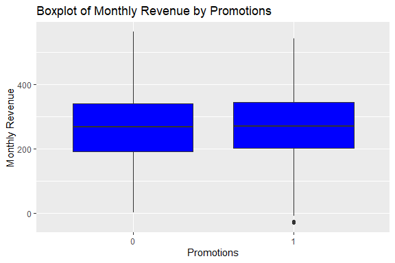

Restaurant Revenue Prediction
================
Trevor Okinda
2024

- [Student Details](#student-details)
- [Setup Chunk](#setup-chunk)
  - [Source:](#source)
  - [Reference:](#reference)
- [Exploratory Data Analysis](#exploratory-data-analysis)
  - [Load dataset](#load-dataset)
  - [Measures of Frequency](#measures-of-frequency)
  - [Measures of Central Tendency](#measures-of-central-tendency)
  - [Measures of Distribution](#measures-of-distribution)
  - [Measures of Relationship](#measures-of-relationship)
  - [ANOVA](#anova)
  - [Plots](#plots)
- [Preprocessing and Data
  Transformation](#preprocessing-and-data-transformation)
  - [Missing Values](#missing-values)
  - [Round-Off Money Columns](#round-off-money-columns)
- [Model Training](#model-training)
  - [Data Splitting](#data-splitting)
  - [Bootstrapping](#bootstrapping)
  - [Cross-validation](#cross-validation)
  - [Model Training](#model-training-1)
  - [Performance Comparison](#performance-comparison)
- [Saving Model](#saving-model)

# Student Details

|                       |                               |
|-----------------------|-------------------------------|
| **Student ID Number** | 134780                        |
| **Student Name**      | Trevor Okinda                 |
| **BBIT 4.2 Group**    | C                             |
| **Project Name**      | Restaurant Revenue Prediction |

# Setup Chunk

**Note:** the following KnitR options have been set as the global
defaults: <BR>
`knitr::opts_chunk$set(echo = TRUE, warning = FALSE, eval = TRUE, collapse = FALSE, tidy = TRUE)`.

More KnitR options are documented here
<https://bookdown.org/yihui/rmarkdown-cookbook/chunk-options.html> and
here <https://yihui.org/knitr/options/>.

### Source:

The dataset that was used can be downloaded here: *\<<a
href="https://www.kaggle.com/datasets/mrsimple07/restaurants-revenue-prediction\"
class="uri">https://www.kaggle.com/datasets/mrsimple07/restaurants-revenue-prediction\</a>\>*

### Reference:

*\<MrSimple07. (2024). Restaurants Revenue Prediction \[Dataset\].
Kaggle. <a
href="https://www.kaggle.com/datasets/mrsimple07/restaurants-revenue-prediction\"
class="uri">https://www.kaggle.com/datasets/mrsimple07/restaurants-revenue-prediction\</a>\>  
Refer to the APA 7th edition manual for rules on how to cite datasets:
<https://apastyle.apa.org/style-grammar-guidelines/references/examples/data-set-references>*

# Exploratory Data Analysis

## Load dataset

``` r
# Load necessary libraries
library(tidyverse)
```

    ## ── Attaching core tidyverse packages ──────────────────────── tidyverse 2.0.0 ──
    ## ✔ dplyr     1.1.4     ✔ readr     2.1.4
    ## ✔ forcats   1.0.0     ✔ stringr   1.5.0
    ## ✔ ggplot2   3.5.1     ✔ tibble    3.2.1
    ## ✔ lubridate 1.9.3     ✔ tidyr     1.3.0
    ## ✔ purrr     1.0.2     
    ## ── Conflicts ────────────────────────────────────────── tidyverse_conflicts() ──
    ## ✖ dplyr::filter() masks stats::filter()
    ## ✖ dplyr::lag()    masks stats::lag()
    ## ℹ Use the conflicted package (<http://conflicted.r-lib.org/>) to force all conflicts to become errors

``` r
# Load dataset
restaurant_data <- read.csv("Restaurant_revenue.csv", colClasses = c(
  Number_of_Customers = "integer",
  Menu_Price = "numeric",
  Marketing_Spend = "numeric",
  Cuisine_Type = "factor",
  Average_Customer_Spending = "numeric",
  Promotions = "factor",
  Reviews = "numeric",
  Monthly_Revenue = "numeric"
))

# Display the structure of the dataset
str(restaurant_data)
```

    ## 'data.frame':    1000 obs. of  8 variables:
    ##  $ Number_of_Customers      : int  61 24 81 70 30 92 96 84 84 97 ...
    ##  $ Menu_Price               : num  43.1 40 42 43 17.5 ...
    ##  $ Marketing_Spend          : num  12.66 4.58 4.65 4.42 3.48 ...
    ##  $ Cuisine_Type             : Factor w/ 4 levels "American","Italian",..: 3 2 3 2 2 1 1 2 1 2 ...
    ##  $ Average_Customer_Spending: num  36.2 18 22.6 19 12.8 ...
    ##  $ Promotions               : Factor w/ 2 levels "0","1": 1 1 2 2 2 2 1 2 1 1 ...
    ##  $ Reviews                  : num  45 36 91 59 30 10 86 1 26 98 ...
    ##  $ Monthly_Revenue          : num  351 221 327 348 185 ...

## Measures of Frequency

``` r
# Load necessary libraries
library(tidyverse)
library(psych)  # for descriptive statistics
```

    ## 
    ## Attaching package: 'psych'

    ## The following objects are masked from 'package:ggplot2':
    ## 
    ##     %+%, alpha

``` r
library(GGally)  # for correlation plots
```

    ## Registered S3 method overwritten by 'GGally':
    ##   method from   
    ##   +.gg   ggplot2

``` r
# Measures of Frequency
# Frequency of factor variables
frequency_promotions <- table(restaurant_data$Promotions)
frequency_cuisine <- table(restaurant_data$Cuisine_Type)
print("Frequency of Promotions:")
```

    ## [1] "Frequency of Promotions:"

``` r
print(frequency_promotions)
```

    ## 
    ##   0   1 
    ## 503 497

``` r
print("Frequency of Cuisine Type:")
```

    ## [1] "Frequency of Cuisine Type:"

``` r
print(frequency_cuisine)
```

    ## 
    ## American  Italian Japanese  Mexican 
    ##      256      232      262      250

## Measures of Central Tendency

``` r
# Measures of Central Tendency
# Mean, Median, Mode
mean_revenue <- mean(restaurant_data$Monthly_Revenue)
median_revenue <- median(restaurant_data$Monthly_Revenue)
mode_revenue <- as.numeric(names(sort(table(restaurant_data$Monthly_Revenue), decreasing = TRUE)[1]))

print(paste("Mean Monthly Revenue:", mean_revenue))
```

    ## [1] "Mean Monthly Revenue: 268.724172299013"

``` r
print(paste("Median Monthly Revenue:", median_revenue))
```

    ## [1] "Median Monthly Revenue: 270.21396425"

``` r
print(paste("Mode Monthly Revenue:", mode_revenue))
```

    ## [1] "Mode Monthly Revenue: -28.97780879"

## Measures of Distribution

``` r
# Measures of Distribution
# Range, Variance, Standard Deviation, Skewness, Kurtosis
range_revenue <- range(restaurant_data$Monthly_Revenue)
variance_revenue <- var(restaurant_data$Monthly_Revenue)
sd_revenue <- sd(restaurant_data$Monthly_Revenue)
skewness_revenue <- skew(restaurant_data$Monthly_Revenue)
kurtosis_revenue <- kurtosi(restaurant_data$Monthly_Revenue)

print(paste("Range of Monthly Revenue:", paste(range_revenue, collapse = " - ")))
```

    ## [1] "Range of Monthly Revenue: -28.97780879 - 563.3813324"

``` r
print(paste("Variance of Monthly Revenue:", variance_revenue))
```

    ## [1] "Variance of Monthly Revenue: 10812.4538841577"

``` r
print(paste("Standard Deviation of Monthly Revenue:", sd_revenue))
```

    ## [1] "Standard Deviation of Monthly Revenue: 103.982949968529"

``` r
print(paste("Skewness of Monthly Revenue:", skewness_revenue))
```

    ## [1] "Skewness of Monthly Revenue: -0.0555613429231458"

``` r
print(paste("Kurtosis of Monthly Revenue:", kurtosis_revenue))
```

    ## [1] "Kurtosis of Monthly Revenue: -0.29139882737887"

## Measures of Relationship

``` r
# Measures of Relationship
# Correlation matrix
correlation_matrix <- cor(restaurant_data %>% select_if(is.numeric))

print("Correlation Matrix:")
```

    ## [1] "Correlation Matrix:"

``` r
print(correlation_matrix)
```

    ##                           Number_of_Customers  Menu_Price Marketing_Spend
    ## Number_of_Customers               1.000000000 0.033469818    -0.007024062
    ## Menu_Price                        0.033469818 1.000000000     0.016319321
    ## Marketing_Spend                  -0.007024062 0.016319321     1.000000000
    ## Average_Customer_Spending        -0.013897855 0.020807583    -0.058586315
    ## Reviews                          -0.010140345 0.003792407    -0.031470055
    ## Monthly_Revenue                   0.745238928 0.259578757     0.269928643
    ##                           Average_Customer_Spending      Reviews
    ## Number_of_Customers                     -0.01389786 -0.010140345
    ## Menu_Price                               0.02080758  0.003792407
    ## Marketing_Spend                         -0.05858631 -0.031470055
    ## Average_Customer_Spending                1.00000000  0.054163061
    ## Reviews                                  0.05416306  1.000000000
    ## Monthly_Revenue                         -0.03566485 -0.024945761
    ##                           Monthly_Revenue
    ## Number_of_Customers            0.74523893
    ## Menu_Price                     0.25957876
    ## Marketing_Spend                0.26992864
    ## Average_Customer_Spending     -0.03566485
    ## Reviews                       -0.02494576
    ## Monthly_Revenue                1.00000000

``` r
# Visualize the correlation matrix
ggcorr(restaurant_data %>% select_if(is.numeric), label = TRUE)
```

<!-- -->

## ANOVA

``` r
# Load necessary libraries
library(tidyverse)
library(car)  # for ANOVA assumptions tests
```

    ## Loading required package: carData

    ## 
    ## Attaching package: 'car'

    ## The following object is masked from 'package:psych':
    ## 
    ##     logit

    ## The following object is masked from 'package:dplyr':
    ## 
    ##     recode

    ## The following object is masked from 'package:purrr':
    ## 
    ##     some

``` r
library(ggplot2)

# ANOVA to compare Monthly Revenue across different Cuisine Types
anova_cuisine <- aov(Monthly_Revenue ~ Cuisine_Type, data = restaurant_data)
summary(anova_cuisine)
```

    ##               Df   Sum Sq Mean Sq F value Pr(>F)
    ## Cuisine_Type   3     8479    2826   0.261  0.854
    ## Residuals    996 10793163   10837

``` r
# ANOVA to compare Monthly Revenue across different Promotions
anova_promotions <- aov(Monthly_Revenue ~ Promotions, data = restaurant_data)
summary(anova_promotions)
```

    ##              Df   Sum Sq Mean Sq F value Pr(>F)
    ## Promotions    1     2388    2388   0.221  0.639
    ## Residuals   998 10799253   10821

``` r
# Check assumptions of ANOVA

# 1. Homogeneity of variances
leveneTest(Monthly_Revenue ~ Cuisine_Type, data = restaurant_data)
```

    ## Levene's Test for Homogeneity of Variance (center = median)
    ##        Df F value Pr(>F)
    ## group   3  2.0204 0.1094
    ##       996

``` r
leveneTest(Monthly_Revenue ~ Promotions, data = restaurant_data)
```

    ## Levene's Test for Homogeneity of Variance (center = median)
    ##        Df F value Pr(>F)
    ## group   1    0.34   0.56
    ##       998

``` r
# 2. Normality of residuals
# Residual plots for Cuisine_Type ANOVA
par(mfrow = c(2, 2))
plot(anova_cuisine)
```

<!-- -->

``` r
# Residual plots for Promotions ANOVA
par(mfrow = c(2, 2))
plot(anova_promotions)
```

<!-- -->

## Plots

``` r
# Visualize the results

# Boxplot for Cuisine_Type
ggplot(restaurant_data, aes(x = Cuisine_Type, y = Monthly_Revenue)) +
  geom_boxplot() +
  labs(title = "Monthly Revenue by Cuisine Type", x = "Cuisine Type", y = "Monthly Revenue")
```

<!-- -->

``` r
# Boxplot for Promotions
ggplot(restaurant_data, aes(x = Promotions, y = Monthly_Revenue)) +
  geom_boxplot() +
  labs(title = "Monthly Revenue by Promotions", x = "Promotions", y = "Monthly Revenue")
```

<!-- -->

``` r
# Load necessary libraries
library(tidyverse)


# Univariate Plots

# Histogram for Monthly Revenue
ggplot(restaurant_data, aes(x = Monthly_Revenue)) +
  geom_histogram(binwidth = 50, fill = "blue", color = "black") +
  labs(title = "Histogram of Monthly Revenue", x = "Monthly Revenue", y = "Frequency")
```

<!-- -->

``` r
# Density plot for Monthly Revenue
ggplot(restaurant_data, aes(x = Monthly_Revenue)) +
  geom_density(fill = "blue", alpha = 0.5) +
  labs(title = "Density Plot of Monthly Revenue", x = "Monthly Revenue", y = "Density")
```

<!-- -->

``` r
# Boxplot for Monthly Revenue
ggplot(restaurant_data, aes(y = Monthly_Revenue)) +
  geom_boxplot(fill = "blue") +
  labs(title = "Boxplot of Monthly Revenue", y = "Monthly Revenue")
```

<!-- -->

``` r
# Bar plot for Cuisine Type
ggplot(restaurant_data, aes(x = Cuisine_Type)) +
  geom_bar(fill = "blue") +
  labs(title = "Bar Plot of Cuisine Type", x = "Cuisine Type", y = "Count")
```

<!-- -->

``` r
# Bar plot for Promotions
ggplot(restaurant_data, aes(x = Promotions)) +
  geom_bar(fill = "blue") +
  labs(title = "Bar Plot of Promotions", x = "Promotions", y = "Count")
```

<!-- -->

``` r
# Multivariate Plots

# Scatter plot for Average Customer Spending vs Monthly Revenue
ggplot(restaurant_data, aes(x = Average_Customer_Spending, y = Monthly_Revenue)) +
  geom_point(color = "blue") +
  labs(title = "Scatter Plot of Average Customer Spending vs Monthly Revenue",
       x = "Average Customer Spending", y = "Monthly Revenue")
```

<!-- -->

``` r
# Scatter plot for Marketing Spend vs Monthly Revenue, colored by Cuisine Type
ggplot(restaurant_data, aes(x = Marketing_Spend, y = Monthly_Revenue, color = Cuisine_Type)) +
  geom_point() +
  labs(title = "Scatter Plot of Marketing Spend vs Monthly Revenue by Cuisine Type",
       x = "Marketing Spend", y = "Monthly Revenue")
```

<!-- -->

``` r
# Boxplot of Monthly Revenue by Cuisine Type
ggplot(restaurant_data, aes(x = Cuisine_Type, y = Monthly_Revenue)) +
  geom_boxplot(fill = "blue") +
  labs(title = "Boxplot of Monthly Revenue by Cuisine Type", x = "Cuisine Type", y = "Monthly Revenue")
```

<!-- -->

``` r
# Boxplot of Monthly Revenue by Promotions
ggplot(restaurant_data, aes(x = Promotions, y = Monthly_Revenue)) +
  geom_boxplot(fill = "blue") +
  labs(title = "Boxplot of Monthly Revenue by Promotions", x = "Promotions", y = "Monthly Revenue")
```

<!-- -->

``` r
# Pair plot for numeric variables
ggpairs(restaurant_data %>% select_if(is.numeric), title = "Pair Plot of Numeric Variables")
```

<!-- -->

# Preprocessing and Data Transformation

## Missing Values

``` r
# Confirm presence of missing values

# Summary of missing values for each column
missing_values_summary <- colSums(is.na(restaurant_data))
print("Summary of missing values for each column:")
```

    ## [1] "Summary of missing values for each column:"

``` r
print(missing_values_summary)
```

    ##       Number_of_Customers                Menu_Price           Marketing_Spend 
    ##                         0                         0                         0 
    ##              Cuisine_Type Average_Customer_Spending                Promotions 
    ##                         0                         0                         0 
    ##                   Reviews           Monthly_Revenue 
    ##                         0                         0

``` r
# Total number of missing values in the dataset
total_missing_values <- sum(is.na(restaurant_data))
print(paste("Total number of missing values in the dataset:", total_missing_values))
```

    ## [1] "Total number of missing values in the dataset: 0"

## Round-Off Money Columns

``` r
# Round off specified columns to 2 decimal places
restaurant_data <- restaurant_data %>%
  mutate(
    Monthly_Revenue = round(Monthly_Revenue, 2),
    Average_Customer_Spending = round(Average_Customer_Spending, 2),
    Marketing_Spend = round(Marketing_Spend, 2),
    Menu_Price = round(Menu_Price, 2)
  )


# Display the first few rows of the dataset to verify the rounding
head(restaurant_data)
```

    ##   Number_of_Customers Menu_Price Marketing_Spend Cuisine_Type
    ## 1                  61      43.12           12.66     Japanese
    ## 2                  24      40.02            4.58      Italian
    ## 3                  81      41.98            4.65     Japanese
    ## 4                  70      43.01            4.42      Italian
    ## 5                  30      17.46            3.48      Italian
    ## 6                  92      19.43           13.11     American
    ##   Average_Customer_Spending Promotions Reviews Monthly_Revenue
    ## 1                     36.24          0      45          350.91
    ## 2                     17.95          0      36          221.32
    ## 3                     22.60          1      91          326.53
    ## 4                     18.98          1      59          348.19
    ## 5                     12.77          1      30          185.01
    ## 6                     43.10          1      10          399.87

``` r
# Display the structure of the dataset to verify the data type
str(restaurant_data)
```

    ## 'data.frame':    1000 obs. of  8 variables:
    ##  $ Number_of_Customers      : int  61 24 81 70 30 92 96 84 84 97 ...
    ##  $ Menu_Price               : num  43.1 40 42 43 17.5 ...
    ##  $ Marketing_Spend          : num  12.66 4.58 4.65 4.42 3.48 ...
    ##  $ Cuisine_Type             : Factor w/ 4 levels "American","Italian",..: 3 2 3 2 2 1 1 2 1 2 ...
    ##  $ Average_Customer_Spending: num  36.2 17.9 22.6 19 12.8 ...
    ##  $ Promotions               : Factor w/ 2 levels "0","1": 1 1 2 2 2 2 1 2 1 1 ...
    ##  $ Reviews                  : num  45 36 91 59 30 10 86 1 26 98 ...
    ##  $ Monthly_Revenue          : num  351 221 327 348 185 ...

``` r
# View the dataset in a separate viewer window
View(restaurant_data)
```

# Model Training

## Data Splitting

``` r
# Load necessary libraries
library(caTools)  # For data splitting

# Split the data into training and testing sets
set.seed(123)  # Set seed for reproducibility
split <- sample.split(restaurant_data$Monthly_Revenue, SplitRatio = 0.7)
train_data <- subset(restaurant_data, split == TRUE)
test_data <- subset(restaurant_data, split == FALSE)

# Summary of the split
cat("Training set size:", nrow(train_data), "\n")
```

    ## Training set size: 700

``` r
cat("Testing set size:", nrow(test_data), "\n")
```

    ## Testing set size: 300

## Bootstrapping

``` r
# Load necessary libraries
library(boot)  # For bootstrapping
```

    ## 
    ## Attaching package: 'boot'

    ## The following object is masked from 'package:car':
    ## 
    ##     logit

    ## The following object is masked from 'package:psych':
    ## 
    ##     logit

``` r
# Define the function to compute the statistic of interest (e.g., mean)
bootstrap_mean <- function(data, indices) {
  sample_data <- data[indices, ]
  return(mean(sample_data$Monthly_Revenue))
}

# Perform bootstrap resampling
set.seed(123)  # Set seed for reproducibility
boot_results <- boot(restaurant_data, statistic = bootstrap_mean, R = 1000)

# Summary of bootstrap results
summary(boot_results)
```

    ##      R original   bootBias bootSE bootMed
    ## 1 1000   268.72 -0.0016389 3.3792  268.74

## Cross-validation

``` r
# Load necessary libraries
library(caret)  # For cross-validation
```

    ## Loading required package: lattice

    ## 
    ## Attaching package: 'lattice'

    ## The following object is masked from 'package:boot':
    ## 
    ##     melanoma

    ## 
    ## Attaching package: 'caret'

    ## The following object is masked from 'package:purrr':
    ## 
    ##     lift

``` r
# Define the control parameters for cross-validation
ctrl <- trainControl(method = "cv", number = 5)  # 5-fold cross-validation

# Train a linear regression model using cross-validation
set.seed(123)  # Set seed for reproducibility
lm_model <- train(Monthly_Revenue ~ ., data = train_data, method = "lm", trControl = ctrl)

# Summary of the cross-validated linear regression model
print(lm_model)
```

    ## Linear Regression 
    ## 
    ## 700 samples
    ##   7 predictor
    ## 
    ## No pre-processing
    ## Resampling: Cross-Validated (5 fold) 
    ## Summary of sample sizes: 560, 560, 560, 560, 560 
    ## Resampling results:
    ## 
    ##   RMSE      Rsquared   MAE    
    ##   59.15019  0.6738702  47.5161
    ## 
    ## Tuning parameter 'intercept' was held constant at a value of TRUE

## Model Training

``` r
# Load necessary libraries
library(caret)       # For model training and evaluation
library(rpart)       # For decision trees
library(randomForest)# For random forest
```

    ## randomForest 4.7-1.1

    ## Type rfNews() to see new features/changes/bug fixes.

    ## 
    ## Attaching package: 'randomForest'

    ## The following object is masked from 'package:psych':
    ## 
    ##     outlier

    ## The following object is masked from 'package:dplyr':
    ## 
    ##     combine

    ## The following object is masked from 'package:ggplot2':
    ## 
    ##     margin

``` r
# Define the control parameters for cross-validation
ctrl <- trainControl(method = "cv", number = 5)  # 5-fold cross-validation

# Train a linear regression model
set.seed(123)  # Set seed for reproducibility
lm_model <- train(Monthly_Revenue ~ ., data = train_data, method = "lm", trControl = ctrl)

# Train a decision tree model
set.seed(123)  # Set seed for reproducibility
dt_model <- train(Monthly_Revenue ~ ., data = train_data, method = "rpart", trControl = ctrl)

# Train a random forest model
set.seed(123)  # Set seed for reproducibility
rf_model <- train(Monthly_Revenue ~ ., data = train_data, method = "rf", trControl = ctrl)
```

## Performance Comparison

``` r
# Summary of the models
print(lm_model)
```

    ## Linear Regression 
    ## 
    ## 700 samples
    ##   7 predictor
    ## 
    ## No pre-processing
    ## Resampling: Cross-Validated (5 fold) 
    ## Summary of sample sizes: 560, 560, 560, 560, 560 
    ## Resampling results:
    ## 
    ##   RMSE      Rsquared   MAE    
    ##   59.15019  0.6738702  47.5161
    ## 
    ## Tuning parameter 'intercept' was held constant at a value of TRUE

``` r
print(dt_model)
```

    ## CART 
    ## 
    ## 700 samples
    ##   7 predictor
    ## 
    ## No pre-processing
    ## Resampling: Cross-Validated (5 fold) 
    ## Summary of sample sizes: 560, 560, 560, 560, 560 
    ## Resampling results across tuning parameters:
    ## 
    ##   cp          RMSE      Rsquared   MAE     
    ##   0.05379699  75.66404  0.4711575  61.21983
    ##   0.06124991  76.96719  0.4496369  62.56400
    ##   0.40601562  90.76982  0.3763091  73.14815
    ## 
    ## RMSE was used to select the optimal model using the smallest value.
    ## The final value used for the model was cp = 0.05379699.

``` r
print(rf_model)
```

    ## Random Forest 
    ## 
    ## 700 samples
    ##   7 predictor
    ## 
    ## No pre-processing
    ## Resampling: Cross-Validated (5 fold) 
    ## Summary of sample sizes: 560, 560, 560, 560, 560 
    ## Resampling results across tuning parameters:
    ## 
    ##   mtry  RMSE      Rsquared   MAE     
    ##   2     65.11483  0.6403038  52.02411
    ##   5     61.77341  0.6478015  49.71675
    ##   9     63.11869  0.6335425  50.71625
    ## 
    ## RMSE was used to select the optimal model using the smallest value.
    ## The final value used for the model was mtry = 5.

``` r
# Compare model performance using resamples
models <- list("Linear Regression" = lm_model,
               "Decision Tree" = dt_model,
               "Random Forest" = rf_model)
resamples <- resamples(models)

# Summarize the resampling results
summary(resamples)
```

    ## 
    ## Call:
    ## summary.resamples(object = resamples)
    ## 
    ## Models: Linear Regression, Decision Tree, Random Forest 
    ## Number of resamples: 5 
    ## 
    ## MAE 
    ##                       Min.  1st Qu.   Median     Mean  3rd Qu.     Max. NA's
    ## Linear Regression 42.85540 46.25480 47.09375 47.51610 47.74552 53.63102    0
    ## Decision Tree     58.85398 58.88447 59.41066 61.21983 61.78018 67.16988    0
    ## Random Forest     45.29360 46.46339 48.07067 49.71675 50.07104 58.68506    0
    ## 
    ## RMSE 
    ##                       Min.  1st Qu.   Median     Mean  3rd Qu.     Max. NA's
    ## Linear Regression 51.51688 58.64346 59.51216 59.15019 60.94716 65.13129    0
    ## Decision Tree     71.82444 72.59800 74.02255 75.66404 75.77363 84.10156    0
    ## Random Forest     56.35497 59.24631 60.59215 61.77341 62.69570 69.97791    0
    ## 
    ## Rsquared 
    ##                        Min.   1st Qu.    Median      Mean   3rd Qu.      Max.
    ## Linear Regression 0.6177223 0.6454653 0.6720709 0.6738702 0.7079125 0.7261801
    ## Decision Tree     0.4180632 0.4475406 0.4661484 0.4711575 0.4740876 0.5499478
    ## Random Forest     0.6219124 0.6226657 0.6407720 0.6478015 0.6710994 0.6825582
    ##                   NA's
    ## Linear Regression    0
    ## Decision Tree        0
    ## Random Forest        0

# Saving Model

``` r
# Saving the Linear Regression (lm) model
saveRDS(lm_model, "./models/saved_lm_model.rds")

# Load the saved model
loaded_lm_model <- readRDS("./models/saved_lm_model.rds")

# Prepare new data for prediction
new_data <- data.frame(
  Number_of_Customers = 61,
  Menu_Price = 43.11763549,
  Marketing_Spend = 12.66379252,
  Cuisine_Type = "Japanese",
  Average_Customer_Spending = 36.23613252,
  Promotions = "0",
  Reviews = 45
)

# Use the loaded model to make predictions
predictions_loaded_model <- predict(loaded_lm_model, newdata = new_data)

# Print predictions
print(predictions_loaded_model)
```

    ##        1 
    ## 332.5445
